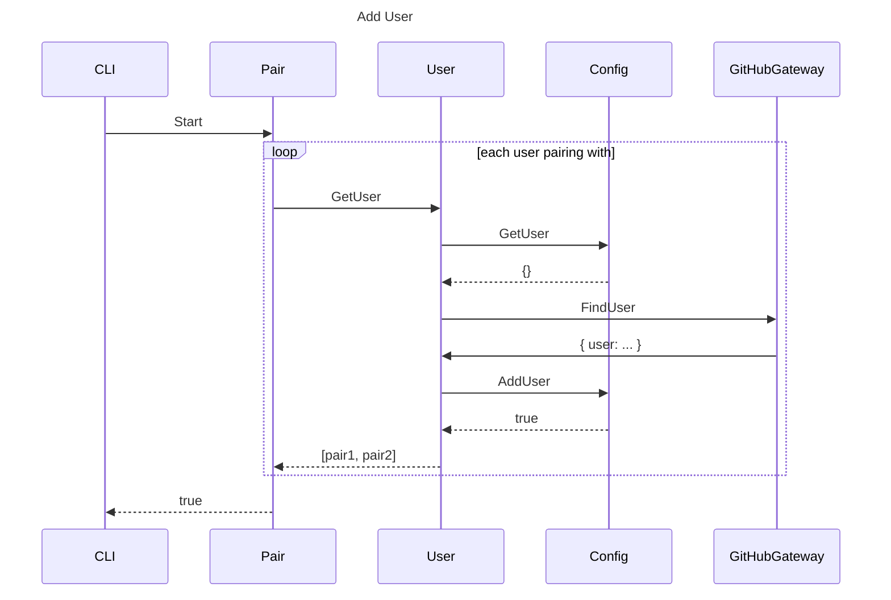

# mob-up

Pair or mob program with ease.

```mermaid
sequenceDiagram
  title Add User
  CLI ->> Pair: Start
  loop each user pairing with
    Pair ->> User: GetUser
      User ->> Config: GetUser
      Config -->> User: {}
      User ->> GitHubGateway: FindUser
      GitHubGateway ->> User: { user: ... }
      User ->> Config: AddUser
      Config -->> User: true
    User -->> Pair: [pair1, pair2]
  end
  Pair -->> CLI: true
```
